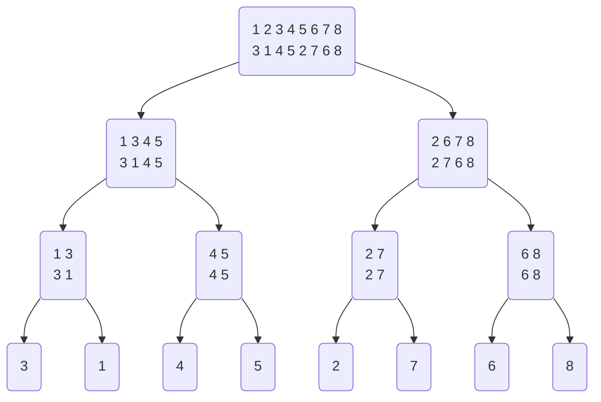

# 1.什么是暴力
暴力解就是用最直接的方法完成题目要求。类似我们做数学题，先把题目所给条件罗列一下，然后按照题目要求一步步运用条件，不自己加工，也不漏用。

算法考试所有的题目操作都可以分为四部分：
1. 读入数据
2. 存储数据
3. 操作数据
4. 输出数据

在上一篇文档中已经讲解了输入输出和一些操作数据的基本方法，本篇文档将讲述根据题意，运用上面的操作的方法和选择操作的逻辑。

如：计算1到100的和，暴力解法就是直接计算1 + 2 + 3 + ... + 100
用代码表示就是
``` C
int sum = 0;
for(int i = 1; i <= 100; ++i){
    sum = sum + i;
}
```
而用公式$(1 + 100) * 100 / 2$就不叫暴力，因为公式并非根据题意直接得到。
或是如：统计数组a = [1, 2, 3, 4, 5, 6, 7, 8]中的奇数个数，暴力解法便为，先判断1是不是奇数，1是，然后看2是不是，3是不是。。如此重复下去，直到把整个数组的元素都判断完毕，最终发现共有4个奇数。
而直接脱口而出4个，并不是暴力解。
# 2. 暴力解的意义
## 2.1 降低问题难度
面对一眼看不出来的思路的问题，通过暴力解可以循序渐进的解决问题。根据上面两个例子，暴力解看似非常机械，单调，重复，麻烦，并不是一个经济的解决问题的办法。但是对于算法考试来说，考试内容是用计算机编程求解问题，而计算机最擅长做的工作，正是上面所说的，重复，单调，麻烦，但是有规律的工作。因此，题目所给出的问题，一定会存在一些重复的，单调的，有规律的地方，（没规律的不重复也没法用代码写）。所以在算法考试中，先利用暴力这一简单，直接的办法去求解问题，往往可以发现问题的规律所在，得到一些启发，再根据规律，对暴力解进行优化，便降低了得到最优解的难度
## 2.2 平稳考试心态
除此以外，在考试中，有了暴力解，一道题就不至于0分，对于心态也有一个较强的安抚作用，不至于将自己置于手足无措的境地。
## 2.3 验证思路
暴力解通常是对题意最直接的理解以及对思路最简单的表达，如果暴力解正确，可以证明大致思路方向没错。同时在本机运行程序是没有时间和内存限制的，因此可以通过对比暴力解和优化解的答案是否相同，来判断优化解是否正确。
# 3. 书写暴力解的方法
## 3.1 循环
如前文所述，算法考试中大部分问题都存在重复的部分，循环又称迭代，是解决重复问题最常用的写法，下面通过几个例题来说明具体如何利用循环书写暴力
### [3.1.1.两数之和](https://leetcode.cn/problems/two-sum/description)

看看题意，让找两个和为目标值的不同整数，那直接把所有两两不同的都枚举一遍。
第一个样例[2, 7, 11 15]
按照小学数数方法，先固定第一个，然后和后面三个组合，组合出来(2, 7); (2, 11); (2, 15)，再固定第二个，和后面俩组合得到(7, 11); (7, 15)，再固定第三个，得到(11, 15)，不重不漏，结束了。

让计算机来做这个过程，那就是先搞一层循环，表示第一个固定的数，里面再套一层，来枚举他后面的所有数。
``` C
for(int i = 0; i < numsSize; ++i){
        for(int j = i + 1; j < numsSize; ++j){
        }
}
```
i代表第一个变量的下标，j代表第二个变量的下标。

完成枚举之后，题目还需要我们判断，两个数的和是否等于目标值k，这个很好书写，直接用if表达就可以了
``` C
if(nums[i] + nums[j] == target)
```
题目还说，只有一种答案，那说明，得到目标解之后，后面的都不用判断了，直接输出俩下标就行了。
``` C
if(nums[i] + nums[j] == target){
    ans[0] = i;
    ans[1] = j;
    *returnSize = 2;
    return ans;
}
```
最后把代码合并一下，就可以提交了
``` C
int* twoSum(int* nums, int numsSize, int target, int* returnSize) {
    int* ans = (int*)malloc(sizeof(int)*2);//开辟存储空间，存储答案
    for(int i = 0; i < numsSize; ++i){
        for(int j = i + 1; j < numsSize; ++j){//两重循环枚举所有的两个数的组合
            if(nums[i] + nums[j] == target){//找到符合条件的答案
                ans[0] = i;
                ans[1] = j;//记录答案，返回
                *returnSize = 2;
                return ans;
            }
        }
    }
    *returnSize = 2;
    return ans;
}
```
**总结：**题目非常直接，暴力解一般可以直接书写，同时此题数据范围也比较小，暴力解可以直接通过。
### [3.1.2.反转字符串](https://leetcode.cn/problems/reverse-string/description/)
题目要求是将字符串倒过来，乍一看好像，这还用写代码？反过来就完了呗。那就自己先写两个试试找找规律。
0 1 2 3 4 5 6
a b c d e f g
g f e d c b a

0 1 2 3
a b c d
d c b a
观察发现，C语言中，字符为基本操作单位，那就要从字符的角度观察，每个字符再交换后，到了哪个位置，
abcdefg的操作过程为：
g b c d e f a
g f c d e b a
g f e d c b a
整个过程为第一个和倒数第一个交换，第二个和倒数第二个交换，直到正数和倒数为同一个数，停止交换。
代码写出来
``` C
int lo = 0;//正数下标
int hi = sSize - 1;//倒数下标
while(lo < hi){
    swap(&s[lo], &s[hi]);//逐个交换
    lo++;
    hi--;
}
```
可能有些写法会将正数下标写成i，倒数下标写成n - i - 1，我个人认为使用两个变量分别表示正数倒数更加直接，也更不易出错，即该写法更“暴力”，故此处使用lo和hi两个变量来表示。

**总结**：此类题目通常为用计算机去模拟日常中看似能够“一步解决”的问题，如例题中的反转字符串，以及练习题中的字符串相加，遇到此类问题不妨耐心动手实践一下，尝试将问题再次分割至更基本的操作，根据更基本的操作，来书写暴力解

### [3.1.3 车厢重组](https://www.luogu.com.cn/problem/P1116)
这个题的和上一个题类似，看起来好像更加迷惑了，还是需要一步步操作。
仔细阅读题面，抽丝剥茧发现就是，有一个序列，每次只能交换相邻的两个元素，然后任务是对这个玩意进行排序，求需要交换多少次。
那我们模拟一下这个过程，是不是很像我们所熟悉的冒泡排序过程呢？只需要增加一个计数器，每次交换元素时，令计数器+1即可。
```C
#include<stdio.h>
#include<stdlib.h>
#define MAXN 10000
void swap(int* a, int* b){
    int temp = *a;
    *a = *b;
    *b = temp;
}
int Bubble_count(int* a, int n){
    int cnt = 0;
    for(int i = n - 1; i >= 1; --i){
        for(int j = 0; j < i; ++j){
            if(a[j + 1] < a[j]){
                swap(&a[j + 1], &a[j]);
                cnt++;
            }
        }
    }   
    return cnt;
}
int main(){
    int* a = (int*)malloc(sizeof(int)*MAXN);
    int n;
    scanf("%d", &n);
    for(int i = 0; i < n; ++i){
        scanf("%d", &a[i]);
    }

    int ans = Bubble_count(a, n);
    free(a);
    printf("%d", ans);
}
```
### [3.1.4 2的幂](https://leetcode.cn/problems/power-of-two/description/)
题目要求判断给定的数x是否为2的幂，正推好像没有什么思路，但是如果给定一个2的次幂$2^k$，我们可以判断，$2^k$这个数是否和x相等，因此问题可以反推解决，即从0开始枚举2的次方，判断是否存在2的k次方和x相等，直到$2^k$大于x时停止枚举。
``` C
bool isPowerOfTwo(int n) {
    if(n <= 0) return false;//负数肯定不是
    for(int i = 0; i < 31; ++i){
        if((1 << i) == n)
            return true;
    }
    return false;
}

```
**总结:** 有些问题难以直接求解，但较易验证一个答案是否为问题的解，此类问题可以通过**枚举答案->验证**的方法进行解答。
### 3.1.4 其他习题
[力扣14. 最长公共前缀](https://leetcode.cn/problems/longest-common-prefix/description/)
[力扣643. 子数组最大平均数](https://leetcode.cn/problems/maximum-average-subarray-i/description/)
**提示：** 可以先不管题解，直接练习暴力，每次取5个，计算平均数，然后留下最大值，题解方法如何由暴力得到后面会有讲解
[力扣2529. 正整数和负整数的最大计数](https://leetcode.cn/problems/maximum-count-of-positive-integer-and-negative-integer/)
[洛谷P1428 小鱼比可爱](https://www.luogu.com.cn/problem/P1428)
[力扣415. 字符串相加](https://leetcode.cn/problems/add-strings/description/)
**提示：** 先试试列竖式计算，然后用代码实现这个过程即可
[力扣1011. D天内送达包裹的能力](https://leetcode.cn/problems/capacity-to-ship-packages-within-d-days/description/)
**提示：** 直接求天数确实不好求，但是可以先验证此问题：“若每天运送的能力为k的，包裹是否能在days天内送完？”，再观察答案，显然若运送能力无限，包裹肯定能送达，因此可以从包裹里面的最小值开始枚举答案，直到答案合法为止，即可以得到问题答案。
此题可利用二分法优化，后面会进行讲解
[洛谷P1089 津津的储蓄计划](https://www.luogu.com.cn/problem/P1089)
## 3.2 递归
问题中重复的部分，有时用递归更方便表达，同时，递归和迭代之间，也可以相互转换。
### [3.2.1 斐波那契数列](https://www.luogu.com.cn/problem/P1962)
题目要求求出斐波那契数列第n项的值，那我们可以定义一个函数，其返回斐波那契数列第n项的值，按照题意直接写就完了
```C
int fib(int n){
    if(n == 1 || n == 2) return 1;
    else return fib(n - 1) + fib(n - 2);
}
```
题目中要求取模，那返回的时候再取个模就完事。
```C
#include<stdio.h>
int fib(int n){
    if(n == 1 || n == 2) return 1;
    else return fib(n - 1) + fib(n - 2);
}
int main(){
    int n;
    scanf("%d", &n);
    int p = 1e9 + 7;
    printf("%d", fib(n)%p);
    return 0;
}
```
这个代码肯定是没法通过的，但在一定数据范围内可以得到正确答案，对于较大的数据量，暴力解法通常只能得到部分正确答案，但不能在规定用时和空间内得到所有正确答案，原因以及优化方法在后面会有讲解。
[想通过可以试试这个](https://leetcode.cn/problems/n-th-tribonacci-number/description/)
## 3.3 总结
暴力就是使用最直接的办法去利用题目条件解决问题。通常有三类问题，第一类问题可直接根据题意进行表达，第二类问题为用计算机去模拟一些看似简单的人工操作，此类问题需要一定的耐心，去分解这些日常中看似“一步完成”的问题，最后一类问题通常难以直接求解，但较易验证一个答案是否为合法解，此类问题可以通过枚举答案然后验证来得到问题的最终解。
  
# 4. 高级暴力
面对一些较为复杂的问题，直接求解通常较为困难，但是可以先将大问题划分为一些规模较小，较为简易的问题，再对这些简单的问题逐个进行求解，便可做到“大事化小，小事化了”。但这些简单问题也不一定能一次求解，还可能需要继续划分，这时我们需要及时判断，这种划分方法是否能有效的得到问题的解。下面将讲述一些划分方法和一些判断方法。

## 4.1 减而治之
有些问题，我们可以通过将问题分割为一个能够暴力解决的问题（称为平凡情况），和一个规模小于原问题，但和原问题相同的子问题的方法划分，不难证明，如此一直对每次划分出的子问题进行上面的操作，总会有一次划分，将子问题的规模减小至平凡解。
就好比我们想将一串珠子拆开，只需每次取下一个珠子，就可以得到一个单个的珠子和比原来珠子少一个的一串珠子，然后不断重复这个过程，最后将会的到一个绳子和一堆单个珠子。
-0000000000-
--000000000-   0
---00000000-   0 0
......
\--------------0- 0 0 0 0 0 0 0 0 0
\-----------------   0 0 0 0 0 0 0 0 0 0

因此，可以将问题划分成一个规模小于原问题，但类型和原问题相同的问题（称作子问题），加上一个可以直接暴力解决的问题的划分方法，可以的得到问题的解。
### 4.1.1 反转字符串
前文提到的反转字符串问题:
>给定一个字符串abcdefg，输出反转之后的字符串。

这个问题似乎不好直接解决，但是可以这样考虑一下：
对于一个长度为n的字符串，表示为S[0, n)，进行如下操作：
1. 交换S[0]和S[n - 1]
2. 反转S[1, n - 1)
如此迭代，直至S中只剩下0个或1个元素。
其中交换两个元素的过程，是可以直接暴力解决的问题，而反转字符串S[1, n - 1)，则是一个和原问题相同的，但规模更小的子问题，不难证明，如此迭代下去，问题规模会不断削减直至平凡情况。
```C
void Reverse_str(char* str, int lo, int hi){//反转str[lo, hi)
    if(hi - lo <= 1){//如果就剩下一个元素或者没有元素
        return;
    }
    swap(str[lo], str[hi - 1]);
    Reverse_str(str, lo + 1, hi - 1);
}
```
### 4.1.2 选择排序
对于排序问题，直接做并不好做，但是可以通过暴力从数组中选出一个最小值，将其放在第一个位置上，这样，数组的第一个位置便成了有序的，然后只需再对后面的序列进行排序，如此迭代，直至所有元素都被选出，便得到了一个有序的序列。
```C
void Select_sort(int a[], int lo, int hi){//将数组中下标[lo, hi)范围的序列排序
    if(hi - lo < 2) return;//一个元素就是有序的
    //先默认最开始的元素是最小的，然后和后面的逐个比较
    for(int i = lo + 1; i < hi; ++i){
        if(a[i] > a[lo]) 
            swap(&a[i], &a[lo]);
    }
    Select(a, lo + 1, hi);//lo位置处的元素已经在正确位置，排序后面即可
}
```

### 4.1.3 [汉诺塔问题](https://leetcode.cn/problems/hanota-lcci/description/)
先[玩玩这个小游戏](https://zhangxiaoleiwk.gitee.io/h.html)一下感受一下，看看能不能发现什么规律。
每次只能挪一个片片，还得上小下大，所以对于一个高度为n的塔，想挪掉最下面的片片，必须得挪掉最上面的n-1个片片，而因为必须上小下大，上面n-1个片也只有高度为n-1的塔这样一种排布方式。
所以这样问题的步骤可以分为：
1. 先把上面高度为n-1的塔挪到中间的柱子上
2. 把最大的片片挪到最后一根柱子上，
3. 把中间柱子上高度为n - 1的塔挪到最后一根柱子上
第一步和第三步，都是和原问题相同，但是规模更小的问题，第二步可以一步暴力解决，这个方法一定能得到问题的解。
```C
void hano(int* A, int* ASize, int* B, int* BSize, int* C, int* CSize, int n){//把A塔上的最上面高度为n的塔，借助B挪到C上
    if(n == 1){//有一个盘子，则可以直接挪
        C[(*CSize)++] = A[--(*ASize)];
        return;
    }
    //多于一个盘子
    hano(A, ASize, C, CSize, B, BSize, n - 1);//先把A最上面的n - 1个挪到B上
    hano(A, ASize, B, BSize, C, CSize, 1);//此时A塔上还剩下一个，就把这一个挪到C塔上
    hano(B, BSize, A, ASize, C, CSize, n - 1);//再把刚才挪到B上面的前面n - 1挪到C上
}
//待实现函数
void hanota(int* A, int ASize, int* B, int BSize, int** C, int* CSize){
    B = (int*)malloc(sizeof(int)*ASize);
    *C = (int*)malloc(sizeof(int)*ASize);
    BSize = 0;
    *CSize = 0;
    hano(A, &ASize, B, &BSize, *C, CSize, ASize);
}
```

### 4.1.4 [全排列](https://leetcode.cn/problems/permutations/description/)
这个问题看起来更加复杂了，但是耐心观察，依然可以利用减而治之的方法解决。
首先，只有一个数字的全排列只有一种，显然可以暴力解决。
对于多于一个数的序列，假设有n个数，那么只需要轮流将每个数放在第一位，找出其他元素的全排列即可。
在寻找其他元素的全排列过程中，依然可以按照上面的方法解决。
例如：序列{1,2,3}
1. 将1放在第一位，作为排列的首元素
2. 找出序列{2, 3}的全排列，放在1后面
3. 再将2放在第一位，作为首元素
4. 找出序列{1, 3}的全排列，放在2后面
5. 将3放在第一位，作为首元素
6. 找出{1, 2}的全排列，放在3后面

如此不难发现，问题规模会不断减小，直至平凡情况

```C
void Get_permute(int* state, int len, int* nums, int numsSize, int* vis, int**res, int* resSize){
    //函数意义为，从nums中选取可选择的元素，生成一个长度为target的全排列，放置在state[len]开始的位置上。在本题中，target可以由numsSize - len得到，故省略
    //state为已经生成的排列，nums为待生成排序的序列， vis表示第[i]个数是否可以被选择， numSize为共有多少个数，len为已生成的排列长度，res为结果，resSize为每个结果的长度
    
    //printf("%d\n", len);
    if(numsSize - target == 0){//已经生成了达标的序列，把答案存下来
        int* temp = (int*)malloc(sizeof(int) * len);
        for(int i = 0; i < len; ++i) {
            temp[i] = state[i];
        }
        //printf("%d\n", returnSize)
        res[(*resSize)++] = temp;
        return;
    }

    for(int i = 0; i < numsSize; ++i){//逐个选择不在序列中的元素作为当前排列的第一个元素
        if(!vis[i]){//如果可以选择
            vis[i] = 1;//后面不能再选这个数了
            state[len] = nums[i];//把这个数放在len处，作为当前待生成排列的第一个数
            Get_permute(state, len+1, nums, numsSize, vis, res, resSize);//生成后面没选的数的全排列
            vis[i] = 0;//下次可以继续用
        }
    }
}
int** permute(int* nums, int numsSize, int* returnSize, int** returnColumnSizes) {
    int** ans = (int**)malloc(sizeof(int*)* 1000);
    int* state = (int*)malloc(sizeof(int)*10);
    int* vis = (int*)malloc(sizeof(int)*10);
    for(int i = 0; i < 10; ++i) vis[i] = 0;
    *returnSize = 0;
    int* ret_col = (int*)malloc(sizeof(int)*1000);
    Get_permute(state, 0, nums, numsSize, vis, ans, returnSize);
    for(int i = 0; i < *returnSize; ++i) ret_col[i] = numsSize;
    *returnColumnSizes = ret_col;
    return ans;
}
```
代码中借助了标记数组vis来表示每个数是否已经在排列中。

### 4.1.5 [数组中第K个最大元素](https://leetcode.cn/problems/kth-largest-element-in-an-array/description/)
看这个之前先看下后面的[快速排序](#422-快速排序)中的轴点划分思想。
在前面的例题中，使用“减而治之”时，每次只将问题减小了一个单位规模，但是对于一些特殊性质的数据，每次可能可以将问题减小很多规模，即根据数据特性排除掉不可能的解，以缩小问题规模，直至平凡解。
下面来看这个例子，首先第一步可以先根据快速排序的思想找到一个轴点，
在长度为n的序列中，找到一个轴点p之后，那么其和k的关系可能有如下三种情况：

**1. p < k**：p及其右边的元素都不可能是第k大的元素，故都被排除，原问题变为了：从轴点p左边的序列中寻找第k大的元素。即k只可能包含在黄色范围内。
<table>
  <tr >
    <td bgcolor=#FFFF00, width = 160px, align = "center"> &lt;p </td>
    <td bgcolor=#organe, width = 10px, align = "center"> k </td>
    <td bgcolor=#FFFF00, width = 40px, align = "center"> &lt;p </td>
    <td bgcolor=#red, width = 10px, align = "center"> p </td>
    <td bgcolor=#blue, width = 140px, align = "center"> p&lt; </td>
  </tr>
</table>

**2. p == k**：此时，已经寻找到了第k大元素，求解过程结束，返回轴点p即可

**3. k < p**：p左边的元素和p本身，都不可能为第k大元素，因此可以将其全部排除，从而将问题变为，在p右边的序列中，寻找第k - p大的元素（排除掉p个，再找k - p大就可以了）。如图，k只可能包含在黄色范围内。

<table>
  <tr >
    <td bgcolor=#blue, width = 160px, align = "center"> &lt;p </td>
    <td bgcolor=#red, width = 10px, align = "center"> p </td>
    <td bgcolor=#FFFF00, width = 40px, align = "center"> p&lt; </td>
    <td bgcolor=#organe, width = 10px, align = "center"> k </td>
    <td bgcolor=#FFFF00, width = 140px, align = "center"> p&lt; </td>
  </tr>
</table>

下面可以写出代码：
```C
int findKthLargest(int* nums, int numsSize, int k) {
    int pivot = GetPivot(nums, 0, numsSize - 1);//和快速排序一样
    if(pivot == k - 1) return nums[pivot];//找到第k大，即下标为k - 1的元素
    else if(pivot < k){
        return findKthLargest(&nums[pivot + 1], numsSize - pivot - 1, k - (pivot + 1));//在右边找第k - p(因为pivot是数组下标，故此处的pivot为上面的p值 - 1，所以k - p = k - (pivot + 1))
    }      
    else{
        return findKthLargest(nums, pivot, k);//在左边找第k大
    }
}
```
### 4.1.6 二分查找
对于一类在有序序列中查找满足特定条件的值的边界点问题时，减而治之依然是一个有效的策略。如：
>在一个长度为n的有序序列中，查找小于k的最大值
输入样例：
第一行两个整数，n和k，第二行n个整数代表序列中的元素值
7 8
1 3 4 9 10 23 34

若采用最简单的暴力方法，便是从第一个元素逐个检验，是否满足“小于k”这一条件，直到遇到一个不满足条件的元素，此时，由于数据的有序性，这个元素及其后面的元素都不再满足条件，故这个元素的前一个元素就是要找的答案。

根据这一性质我们不妨推断，若一个元素e不满足“小于k”这个条件，那么其后面的所有元素都不可能满足，因此e及其后面的元素将都被排除出答案。故要找的元素只能存在于e之前的序列中。（黄色）
问题变为，在e之前的元素中，查找“小于k的最大值”。
<table>
  <tr >
    <td bgcolor=#FFFF00, width = 160px, align = "center"> &lt;k </td>
    <td bgcolor=#organe, width = 10px, align = "center"> k </td>
    <td bgcolor=#FFFF00, width = 40px, align = "center"> k&lt; </td>
    <td bgcolor=#red, width = 10px, align = "center"> e </td>
    <td bgcolor=#blue, width = 140px, align = "center"> k&lt; </td>
  </tr>
</table>

同时，若一个元素e满足“小于k”这个条件，即e < k，那么e及其前面的元素则都满足这个条件，此时，e之前的元素一定不可能是“小于k的最大值”（至少有一个元素e比他大，所以不能是最大值），故要找的元素只能存在于e及其之后的序列中。（黄色）
问题变为，在e及其之后的元素查找“小于k的最大值”。
<table>
  <tr >
    <td bgcolor=#blue, width = 160px, align = "center"> &lt;k </td>
    <td bgcolor=#FFFF00, width = 10px, align = "center"> e </td>
    <td bgcolor=#FFFF00, width = 40px, align = "center"> &lt;k </td>
    <td bgcolor=#organe, width = 10px, align = "center"> k </td>
    <td bgcolor=#FFFF00, width = 140px, align = "center"> k&lt; </td>
  </tr>
</table>

根据以上分析，“减而治之”策略再次发挥作用，但是如何选择元素e去做检验，能使每次尽可能的“减”掉更多的“不满足条件”的值呢？显然选择序列的中点作为e，待查找值位于其两侧的概率相等，平均下来效率是最高的。
故可以得到代码：
```C
int Binary_Search(int* a, int lo, int hi, int k){//在a中[lo, hi)范围内查找小于k的最大值
    if(hi - lo < 2) return lo;//只有一个值，直接返回
    int mid = (lo + hi)/2;
    if(a[mid] < k){
        return Binary_Search(a, mid, hi, k);//在e及其右边的元素中查找
    }
    else{
        return Binary_Search(a, lo, mid, k);//在e左边的元素中查找
    }
}
```
**[例1.D天内送达包裹的能力](https://leetcode.cn/problems/capacity-to-ship-packages-within-d-days/description/)**
在前文中提到的
## 4.2 分而治之
对于某些问题，可以将其分解成两个或者多个和原问题相同，但规模小于原问题的子问题，然后将子问题再分，直至出现平凡情况，之后再通过合并子问题的解，最终得到整个问题的解。此种解决问题的方法叫做分而治之。
就好比我们想把一张纸撕成16片，我们也可以先把他撕成均匀的两片，这样就可以得到两张纸，然后我们只需要把这两张纸每一张都撕成八片即可，问题本身还是撕纸，但是规模减小了一半，之后可以再将得到的两片纸各撕成两半，那现在就得到了四片，现在只需将每片撕成四片即可。再分两次，发现已经是16片了，每片纸不需要再分，问题解决。

### 4.2.1 归并排序
没错又是排序。但是这次采取了不同的暴力算法和分割问题的方法。
先来看下面的一个问题：
>给出两个有序序列A（长度为n）和B（长度为m），将A和B合并成一个有序序列
样例输入：
5
1 3 5 7 9
4
2 4 6 8
样例输出：
1 2 3 4 5 6 7 8 9

这个问题好像比较简单，新开一个空间，每次从两个序列里面选小的放进去就好了
```C
void merge(int* nums1, int nums1Size, int m, int* nums2, int nums2Size, int n) {//将合并后的数组放到nums1中
    int i = 0;
    int j = 0;
    int* a = (int*)malloc(sizeof(int)*(n + m));
    int cnt = 0;
    while(i < m && j < n){//两个序列中都有
        if(nums1[i] < nums2[j]){//取出小的放到新序列中
            a[cnt++] = nums1[i++];
        }
        else{
            a[cnt++] = nums2[j++];
        }
    }
    while(i < m){//第一个序列没用完，直接续上
        a[cnt++] = nums1[i++];
    }
    while(j < n){//第二个序列直接续上
        a[cnt++] = nums2[j++];
    }
    for(int i = 0; i < cnt; ++i){
        nums1[i] = a[i];
    }
    free(a);//释放辅助空间
}
```
可以去[力扣88题](https://leetcode.cn/problems/merge-sorted-array/description/)提交一下
在解决了上面的问题之后，可以考虑，把整个序列一分为二，对左右分别排序，然后对两个有序序列进行归并，直至序列不能再分，如此不就解决了排序问题
过程如图所示，图中每个小块中，上面一行是由下面两个有序序列合并之后的序列，下面是原始序列


按照上面的图示示意，不难写出代码
```C
void Merge_Sort(int* a, int lo, int hi){//数组a，在[lo, hi)范围内排序
    if(hi - lo < 2) return;//一个元素，已经有序
    int mid = (lo + hi)/2;//从中间分开
    Merge_Sort(a, lo, mid);//两边分别排序
    Merge_Sort(a, mid, hi);
    merge(&a[lo], hi - lo, mid - lo, &a[mid], hi - mid, hi - mid);//将排序好的数组合并
}
```
归并排序是稳定排序，如果考试中需要一个又快又稳定的排序，则可以选择使用归并排序。

### 4.2.2 快速排序


## 4.3 搜索
## 4.4 动态规划（记忆化搜索）
# 5. 优化暴力解的方法
## 5.1 评估指标
在考试中，题目数据范围不同，需要采用的算法就不同。因此我们需要根据题目要求和范围，来确定优化程序的方法和程度，尽可能做到在拿到力所能及的分数的同时，避免“杀鸡用牛刀”，造成时间的浪费。
### 5.1.1 时间复杂度
通常情况下，计算机主频为GHz级别，即1秒钟能执行$10^9$次运算，大部分考试程序运行限时都为1s，考虑到复杂度的常数影响，算法复杂度和在1s内能处理数据范围如下表所示
|算法复杂度| 在1s内能处理的数据范围|
|   --- | ---|
|$O(1)$ | 任何问题 |
|$O(log(n))$ | 几乎任何问题|
|$O(n)$ | $n <= 10^7$ |
|$O(nlog(n))$ | $n <= 10^5$ |
|$O(n^2)$| $n <= 5000$ |
|$O(n^3)$| $n <= 500$ |
|$O(2^n)$| $n <= 50$ |

根据上述经验，大概可以判断算法是否需要继续优化，如题目中范围只有50，任何暴力解法只要给出正确答案，都可以拿到满分，但是若数据量在$10^3$数量级，需要考虑$O(n^2)$的算法，也就是使用两层循环，就可以拿到全部分数，但是也不需要再优化到一重循环。
**切记：** 在限定时间内得到规定答案即可，快了没有更多的分数，但是优化有风险，既耗费考试时间，又可能出错，因此完全没必要过度优化程序。
### 5.1.2 空间复杂度
由于时间复杂度为空间复杂度的天然上界（每使用一个单位的空间，都需要对这个空间进行操作，即要耗费$O(1)$的时间），因此通常题目对空间的要求较低，根据数据范围分配空间，基本都不会出问题。
若看到对空间复杂度有特殊要求的题目，谨慎使用递归！
## 5.2 去重
过于直接的暴力解，通常会有许多重复计算。通过仔细观察每次计算过程，发现重复部分，通过记忆，提前结束循环等方式减少重复，便可优化暴力解。
### [4.2.1 子数组最大平均数](https://leetcode.cn/problems/maximum-average-subarray-i/description/)
如果按照最直接的方法，会写出如下代码
``` C
double ans = -1e9;
for(int i = 0; i < numsSize - k - 1; ++i){
    int sum = 0;
    for(int j = 0; j < k; ++j){//每次取k个计算
        sum += nums[i + j];
    }
    ans = fmax(ans, (double)sum/k);
}
```
但是仔细观察可以发现，假设k为3，则第一轮的计算值为$a_0 + a_1 + a_2$，第二轮的计算值为$a_1 + a_2 + a_3$，不难发现，两个值的改变只有$a_0$和$a_3$，其中$a_1 + a_2$的值并不需要重新计算，同时根据题意，取平均值的最大值，由平均值计算公式可知，当k个数的和最大时，平均值也最大，因此每次除以k的操作也没有必要进行，故不妨将代码优化
``` C
double findMaxAverage(int* nums, int numsSize, int k) {
    int sum = 0;
    for(int i = 0; i < k; ++i){
        sum += nums[i];
    }//先算前k个
    int ans = sum;
    for(int i = k; i < numsSize; ++i){//不断往后挪，去掉第一个，加上当前的
        sum -= nums[i - k];//减去最前面的
        sum += nums[i];//加上一个新的
        ans = fmax(sum, ans);//记录大的
    }
    return (double)ans/k;
}
```
经以上优化，时间复杂度由$O(nk)$变为$O(n)$，大幅度减小，效果显著
### [4.2.2查找总价格为目标值的商品](https://leetcode.cn/problems/he-wei-sde-liang-ge-shu-zi-lcof/description/)
此题暴力思路和两数之和类似，都是两重循环枚举。但是有一个额外条件，就是数据有序，那么在枚举的时候，如果枚举到$(price_i + price_j) > target$，那么说明i和j后面的其他元素相加也会大于target，故可以直接排除后面的所有情况。
因此可以优化如下：
``` C
for(int i = 0; i < priceSize; ++i){
    for(int j = i + 1; j < priceSize; ++j){
        if(price[i] + price[j] == target){
            ans[0] = price[i];
            ans[1] = price[j];
            *returnSize = 2;
            return ans;
        }
        else if(price[i] + price[j] > target) break;//大于则不再找
    }
}
```
这个优化之后虽然对平均情况下时间复杂度没有数量级上的改变，都是$O(n^2)$，但也有一定程度的优化，在考试中可能可以多过几个点。
## 5.3 数据结构
数据结构可以按一定的顺序组织数据，并且高效的实现某些操作。
此处不再花费篇幅去介绍数据结构的逻辑性质和数学推理证明，而通过对某些有特定性质的数据，提出一些问题，然后逐步解决这些问题，去逐步书写代码。
### 5.3.1 栈和队列
#### 栈
现在要设计一个满足如下功能的序列容器。其有两个操作：
1. 向序列中加入一个元素
2. 返回最新加入的元素的值，并将元素从这个序列中删除

看到问题，按照前面解决问题的思路，先读入然后存储数据。因为要存储一个序列，可以考虑使用数组来存储。由于不知道要加入多少个元素，因此可以采用前文中复制字符串的cnt策略，每次加入元素时这个计数器+1，其既表示了容器中元素的个数，同时也代表了加入元素时写入的位置。删除时，令计数器-1，然后读取结果即可。

由于这种操作看起来非常像，每次将物体放到容器顶端，然后需要取的时候，从顶端取出（想象一下刷盘子的时候），因此这个计数器命名为top。
这种容器就被命名为栈，top又称栈顶。
```C
void Add(int S[], int* top, int x){//S是容器数组，top是栈顶指针，此处用两种写法方便区分，x为待加入元素
    S[(*top)] = x;
    (*top)++;
}
```
```C
int Delete(int S[], int* top){
    int ret = S[(*top) - 1];//返回栈顶元素
    *(top)--;
    return ret;
}
```
**例1：[小行星碰撞](https://leetcode.cn/problems/asteroid-collision/description/?envType=list&envId=CMcRiC2r)**
**例2：[415.字符串相加](https://leetcode.cn/problems/add-strings/description/?envType=list&envId=CMcRiC2r)**
**例3：[43.字符串相乘](https://leetcode.cn/problems/multiply-strings/description/?envType=list&envId=CMcRiC2r)**

#### 队列
队列是满足下面功能的序列容器，其也有两个操作：
1. 向容器中加入元素
2. 取出容器中最早加入的元素


### 5.3.2 链表

### 5.3.3 树
### 5.3.4 图
### 5.3.5 堆（优先队列）
[例题：239.滑动窗口最大值](https://leetcode.cn/problems/sliding-window-maximum/description/)
### 5.3.6 平衡树
### 5.3.7 线段树
[例题：1622.奇妙序列](https://leetcode.cn/problems/fancy-sequence/description/)
### 5.3.8 树状数组
[例题：307.区域和检索-数组可修改](https://leetcode.cn/problems/range-sum-query-mutable/description/)


# 5. 骗分
考试如果遇到实在解不出来的部分，我们不能心甘情愿的就放弃，能争取还是需要争取一下的，骗分一定切记，不能贪多，因为反正我不会，拿一分我赚一分
## 5.1 打表
### 5.1.1 伐木工（机试200分题目）

**题目描述**
> 一根x米长的树木，伐木工切割成不同长度的木材进行交易，交易价格为每根木头长度的乘积，规定切割后每根木头的长度为正整数，也可以不切割，直接拿整根数目进行交易，请问伐木工如何更少的切割，才能使收益最大化?
**输入描述：** 木材长度x(x<=50)
**输出描述:** 切割方案，以空格分割，升序排列
**样例输入：** 10
**样例输出：** 3 3 4

看完题目之后，这好像短时间内不好写，但是观察一下，确实有白送的分
显然长度为1，2，3都不用切割，4可以切成2*2也可以不切，因为要求尽可能少切，所以4也不用切
5切成2和3，6切成3和3，7切成3和4
8好像就不太好算了，是2，3，3，不算那么白送了，如果还有别的题没做，那就先写前面的代码，拿到白送的分，然后看其他题
``` C
switch(x){
    case 1:{
        printf("1");
        break;
    }
    case 2:{
        printf("2");
        break;
    }
 
    case 3:{
        printf("3");
        break;
    }
    case 4:{
        printf("4");
        break;
    }
    case 5:{
        printf("5");
        break;
    }
    case 6:{
        printf("6");
        break;
    }
    case 7:{
        printf("7");
        break;
    }
}
```
## 5.2 找规律


